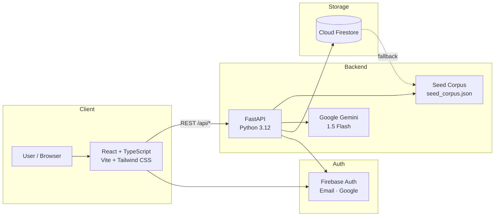

<p align="center">
  <strong style="font-size:2rem;">Regnify</strong>
</p>

<p align="center">
  <em>Know the Change. Take Action.</em>
</p>

<p align="center">
  AI-powered regulatory intelligence and compliance platform that transforms dense government notifications into prioritized, actionable compliance tasks.
</p>

<p align="center">
  
  
  
  
  
  
  
  
</p>

<p align="center">
  <strong>Live Demo:</strong>&nbsp;
  <a href="https://regnify-five.vercel.app">Frontend</a> ·
  <a href="https://regnify.onrender.com/docs">API Docs</a> ·
  <a href="https://github.com/AdityaP116/Regnify">Repository</a>
</p>

<p align="center">
  <sub>Built for the <strong>Rookery Hackathon 2026 — Keep Building!</strong></sub>
</p>

---

## 🚀 Overview

Businesses and factories operate under a continuous stream of regulatory changes — government notifications, gazette amendments, compliance circulars, and statutory deadlines issued across dozens of federal and state portals. These documents are often dense, written in legal language, and scattered across sources, making it difficult for compliance teams to identify what changed, whether it applies to their business, and what action is required.

**Regnify** bridges this gap by continuously monitoring official regulatory sources, using AI to synthesize complex gazette text into plain-language directives, matching regulations against a business's specific profile (sector, jurisdiction, workforce thresholds), and converting them into prioritized compliance tasks with deadlines and owner assignments.

The platform provides a complete closed-loop workflow: from regulatory discovery through AI-powered understanding, business relevance matching, alert generation, task creation, and compliance tracking — all accessible through a modern dashboard.

> **Note:** Regnify is an information and compliance-assistance platform. Official regulatory sources remain the authoritative source of truth for all statutory requirements.

---

## 🎯 Problem

- **Fragmented sources** — Regulatory notifications arrive from 48+ government portals across central and state jurisdictions
- **Dense legal language** — Gazette text requires specialist interpretation to extract actionable requirements
- **Hidden relevance** — Determining whether a regulation applies to a specific business profile is non-trivial
- **Buried deadlines** — Enforcement windows, compliance dates, and filing deadlines are embedded deep within document text
- **No ownership model** — There is no automatic mapping from a regulation to the person responsible for compliance
- **Reactive workflows** — Teams discover missed requirements only when penalties are issued

---

## 💡 Solution

Regnify implements an eight-stage intelligence pipeline that converts raw government text into tracked compliance outcomes:

```
DISCOVER → UNDERSTAND → CLASSIFY → MATCH → EXPLAIN → ALERT → ACT → TRACK
```

| Stage | What Happens |
|---|---|
| **Discover** | Gazette and notification sources are scanned and indexed |
| **Understand** | NLP extraction parses statutory text into structured fields |
| **Classify** | Regulations are categorized into domain taxonomies (safety, environment, tax, labour) |
| **Match** | Business profile attributes (sector, jurisdiction, NIC code, workforce) determine relevance |
| **Explain** | AI synthesizes the regulation into plain-language "before vs. now" change summaries |
| **Alert** | Severity-ranked alerts are routed based on relevance and deadline proximity |
| **Act** | Compliance tasks are created with owner assignment, priority, and due dates |
| **Track** | Deadline monitoring and status tracking ensure closed-loop compliance |

---

## ✨ Key Features

### Regulatory Intelligence
- Monitoring of government sources across multiple jurisdictions
- Structured regulation records with gazette IDs, authority codes, effective dates, and categories
- Domain concentration analysis across regulatory areas
- Before/after change diffing for each regulation
- Relevance scoring against business profiles

### AI-Powered Analysis
- **Gemini 1.5 Flash** integration for regulatory Q&A grounded in official source context
- Plain-language synthesis of complex statutory text
- Structured JSON responses with confidence scoring, citations, and operational steps
- Source-aware responses — AI interpretation is explicitly distinguished from official text
- Suggested follow-up queries for deeper exploration
- Graceful fallback to deterministic seed responses when Gemini is unavailable

### Compliance Management
- Task creation, assignment, and status tracking (`pending` → `in_progress` → `completed`)
- Priority levels: critical, high, medium, low
- Compliance health gauge with percentage scoring and breakdown by category
- Calendar view with upcoming deadlines and enforcement windows
- Regulatory alerts with severity classification (critical, warning, info)
- Notification system for regulatory updates

### Business Profile
- Detailed business entity configuration: sector, jurisdiction, location, employees, pollution category, NIC codes
- Classification metadata for regulatory matching
- Profile-driven relevance scoring across all regulations

### Authentication & User Management
- Firebase Authentication with Email/Password and Google Sign-In
- User profile management synced to backend
- Onboarding flow for new users
- Session persistence with `browserLocalPersistence`
- Demo mode with local session fallback when Firebase is not configured

---

## 🧠 How It Works

```
┌─────────────────────────────────────────────────────────────┐
│                   Official Sources                          │
│        (48+ Government Portals, Gazettes, Circulars)        │
└──────────────────────────┬──────────────────────────────────┘
                           ▼
┌──────────────────────────────────────────────────────────────┐
│              Regulatory Corpus (seed_corpus.json)            │
│   Structured regulations, sources, alerts, deadlines, tasks  │
└──────────────────────────┬──────────────────────────────────┘
                           ▼
┌──────────────────────────────────────────────────────────────┐
│                   FastAPI Backend                             │
│                                                              │
│  ┌──────────┐  ┌──────────┐  ┌──────────┐  ┌─────────────┐  │
│  │ Auth     │  │ Firestore│  │ Gemini   │  │ Seed        │  │
│  │ (Firebase│  │ CRUD     │  │ AI Q&A   │  │ Corpus      │  │
│  │  Verify) │  │ Helpers  │  │ Service  │  │ Fallback    │  │
│  └──────────┘  └──────────┘  └──────────┘  └─────────────┘  │
└──────────────────────────┬──────────────────────────────────┘
                           ▼
┌──────────────────────────────────────────────────────────────┐
│                    React Frontend                             │
│                                                              │
│  Landing · Dashboard · Regulations · Alerts · Compliance     │
│  Calendar · AI Assistant · Business Profile · Settings       │
│  Notifications · Help · Onboarding                           │
└──────────────────────────────────────────────────────────────┘
```

**Key design decisions:**
- Every API call includes a **seed corpus fallback** — the frontend always resolves data even when the backend or Firebase is unreachable
- Firebase Auth tokens are verified server-side; when Firebase is not configured, a demo UID is issued so all routes remain functional
- The Gemini AI service builds context from relevant regulations and the business profile before querying, ensuring grounded responses

---

## 🏗️ Architecture



---

## 🛠️ Tech Stack

| Layer | Technology | Version |
|---|---|---|
| **Frontend Framework** | React | 18.3 |
| **Language** | TypeScript | 5.6 |
| **Build Tool** | Vite | 5.4 |
| **Styling** | Tailwind CSS | 3.4 |
| **Routing** | React Router | 6.26 |
| **Backend Framework** | FastAPI | 0.115 |
| **Backend Language** | Python | 3.12 |
| **Data Validation** | Pydantic | 2.9 |
| **Configuration** | pydantic-settings | 2.5 |
| **Authentication** | Firebase Auth (client) + Firebase Admin SDK (server) | 10.x / 6.5 |
| **Database** | Cloud Firestore | via firebase-admin |
| **AI Model** | Google Gemini 1.5 Flash | via google-generativeai 0.8 |
| **HTTP Client** | httpx | 0.27 |
| **ASGI Server** | Uvicorn | 0.30 |
| **Frontend Hosting** | Vercel | — |
| **Backend Hosting** | Render | — |

---

## 📁 Project Structure

```
Regnify/
├── frontend/                          # React + TypeScript SPA
│   ├── src/
│   │   ├── components/                # Reusable UI components
│   │   │   ├── dashboard/             # Dashboard-specific widgets
│   │   │   ├── AppShell.tsx           # Authenticated layout shell
│   │   │   ├── Header.tsx             # Top navigation bar
│   │   │   ├── Sidebar.tsx            # Side navigation
│   │   │   ├── AiAnswer.tsx           # AI response renderer
│   │   │   ├── RegulationCard.tsx     # Regulation list card
│   │   │   ├── MetricCards.tsx        # Dashboard metric cards
│   │   │   ├── infographics.tsx       # Process tracker, compliance gauge, pipeline
│   │   │   └── ...
│   │   ├── context/
│   │   │   ├── AuthContext.tsx         # Firebase Auth + demo mode state
│   │   │   └── AppDataContext.tsx      # Global app data (dashboard, regulations, etc.)
│   │   ├── data/
│   │   │   └── seed.ts                # Client-side seed corpus (offline fallback)
│   │   ├── lib/
│   │   │   ├── api.ts                 # API client with backend + seed fallback
│   │   │   ├── firebase.ts            # Firebase initialization (lazy, config-driven)
│   │   │   ├── types.ts               # TypeScript interfaces (synced with backend)
│   │   │   └── format.ts              # Utility functions
│   │   ├── pages/                     # Route-level page components
│   │   │   ├── Landing.tsx            # Public landing page
│   │   │   ├── Overview.tsx           # Main dashboard
│   │   │   ├── Regulations.tsx        # Regulation browser
│   │   │   ├── RegulationDetail.tsx   # Single regulation deep-dive
│   │   │   ├── Alerts.tsx             # Regulatory alerts
│   │   │   ├── Compliance.tsx         # Compliance task manager
│   │   │   ├── Calendar.tsx           # Deadline calendar
│   │   │   ├── Assistant.tsx          # AI regulatory assistant
│   │   │   ├── BusinessProfile.tsx    # Business entity configuration
│   │   │   ├── Onboarding.tsx         # New user onboarding
│   │   │   ├── Settings.tsx           # User settings
│   │   │   └── ...
│   │   └── App.tsx                    # Router + auth guards
│   ├── .env.example                   # Environment variable template
│   ├── .env.production                # Production API URL (committed, no secrets)
│   ├── package.json
│   ├── tailwind.config.js
│   └── vite.config.ts
│
├── backend/                           # FastAPI Python backend
│   ├── app/
│   │   ├── routers/                   # API route modules
│   │   │   ├── health.py              # GET /health
│   │   │   ├── dashboard.py           # GET /api/dashboard
│   │   │   ├── regulations.py         # GET /api/regulations, /api/sources
│   │   │   ├── alerts.py              # GET/PUT /api/alerts
│   │   │   ├── compliance.py          # GET/POST/PUT /api/compliance/tasks
│   │   │   ├── calendar.py            # GET /api/calendar
│   │   │   ├── notifications.py       # GET/PUT /api/notifications
│   │   │   ├── business.py            # GET/PUT /api/business-profile
│   │   │   ├── user.py                # GET/PUT /api/user-profile
│   │   │   └── ai.py                  # POST /api/ai/query
│   │   ├── services/
│   │   │   ├── firebase.py            # Firebase Admin init + Firestore helpers
│   │   │   ├── gemini.py              # Gemini AI Q&A with grounded prompting
│   │   │   └── seed.py                # Seed corpus loader + Firestore seeder
│   │   ├── data/
│   │   │   └── seed_corpus.json       # Deterministic regulatory corpus (35KB)
│   │   ├── auth.py                    # Firebase token verification dependency
│   │   ├── config.py                  # pydantic-settings configuration
│   │   ├── models.py                  # Pydantic models (synced with frontend types)
│   │   └── main.py                    # FastAPI app, CORS, router registration
│   ├── requirements.txt
│   └── .env.example
│
├── firebase/
│   └── firestore.rules                # Firestore security rules
│
├── render.yaml                        # Render Blueprint (backend + frontend)
├── .python-version                    # Python 3.12.10 (for Render)
└── DEPLOYMENT.md                      # Production deployment guide
```

---

## ⚡ Getting Started

### Prerequisites

- **Node.js** 20+
- **Python** 3.12+
- **Firebase project** (optional — the app runs in demo mode without it)

### 1. Clone the repository

```bash
git clone https://github.com/AdityaP116/Regnify.git
cd Regnify
```

### 2. Set up the backend

```bash
cd backend
python -m venv .venv

# Windows
.venv\Scripts\activate
# macOS/Linux
source .venv/bin/activate

pip install -r requirements.txt
```

Create a `.env` file (copy from `.env.example`):

```bash
cp .env.example .env
```

Start the backend:

```bash
uvicorn app.main:app --reload --port 8000
```

The API will be available at `http://localhost:8000`. Interactive docs at `http://localhost:8000/docs`.

### 3. Set up the frontend

```bash
cd frontend
npm install
```

Create a `.env` file (copy from `.env.example`):

```bash
cp .env.example .env
```

Start the development server:

```bash
npm run dev
```

The frontend will be available at `http://localhost:5173`. In development, Vite proxies `/api` requests to the backend at `localhost:8000`.

---

## 🔐 Environment Variables

### Backend (`backend/.env`)

| Variable | Required | Description |
|---|---|---|
| `FRONTEND_URL` | No | CORS-allowed frontend origin. Default: `http://localhost:5173` |
| `DEMO_MODE` | No | Set to `true` to run without Firebase. Default: `false` |
| `FIREBASE_PROJECT_ID` | If not demo | Firebase project ID |
| `FIREBASE_CLIENT_EMAIL` | If not demo | Service account email |
| `FIREBASE_PRIVATE_KEY` | If not demo | Service account private key (with `\n` line breaks) |
| `GOOGLE_APPLICATION_CREDENTIALS` | Alt | Path to service account JSON (alternative to individual fields) |
| `GEMINI_API_KEY` | No | Google Gemini API key for AI assistant |

### Frontend (`frontend/.env`)

| Variable | Required | Description |
|---|---|---|
| `VITE_API_BASE_URL` | No | Backend API URL. Default: `/api` (proxied in dev) |
| `VITE_FIREBASE_API_KEY` | No | Firebase web API key |
| `VITE_FIREBASE_AUTH_DOMAIN` | No | Firebase auth domain |
| `VITE_FIREBASE_PROJECT_ID` | No | Firebase project ID |
| `VITE_FIREBASE_STORAGE_BUCKET` | No | Firebase storage bucket |
| `VITE_FIREBASE_MESSAGING_SENDER_ID` | No | Firebase messaging sender ID |
| `VITE_FIREBASE_APP_ID` | No | Firebase app ID |

> When Firebase config is absent, the frontend runs in **demo mode** with local session persistence and seed data — no Firebase project needed for development.

---

## 📡 API Reference

All endpoints are prefixed with `/api` and require a Firebase Bearer token (or operate in demo mode).

| Method | Endpoint | Description |
|---|---|---|
| `GET` | `/health` | Health check (no auth required) |
| `GET` | `/api/dashboard` | Dashboard snapshot with metrics and pipeline |
| `GET` | `/api/regulations` | List all regulations |
| `GET` | `/api/regulations/:id` | Single regulation detail |
| `GET` | `/api/regulations/domains` | Domain concentration analysis |
| `GET` | `/api/sources` | Monitored government sources |
| `GET` | `/api/alerts` | Regulatory alerts |
| `PUT` | `/api/alerts/:id/read` | Mark alert as read |
| `GET` | `/api/compliance/tasks` | List compliance tasks |
| `POST` | `/api/compliance/tasks` | Create a new compliance task |
| `PUT` | `/api/compliance/tasks/:id` | Update task status/progress |
| `GET` | `/api/calendar` | Upcoming compliance deadlines |
| `GET` | `/api/notifications` | User notifications |
| `PUT` | `/api/notifications/:id/read` | Mark notification as read |
| `GET` | `/api/business-profile` | Business profile |
| `PUT` | `/api/business-profile` | Update business profile |
| `GET` | `/api/user-profile` | User profile |
| `PUT` | `/api/user-profile` | Update user profile |
| `POST` | `/api/ai/query` | AI regulatory Q&A (Gemini-powered) |

Full interactive documentation is available at `/docs` (Swagger UI) and `/redoc`.

---

## 🤖 AI Assistant

The AI regulatory assistant uses **Google Gemini 1.5 Flash** with a retrieval-augmented approach:

1. **Context building** — Relevant regulations are retrieved from the corpus using keyword matching against the user's query
2. **Business grounding** — The user's business profile (sector, jurisdiction, employee count) is included in the context
3. **System prompt** — Gemini is instructed to answer using *only* the provided official regulatory context, never fabricating gazette numbers or deadlines
4. **Structured output** — Responses include:
   - Executive synthesis (plain-language answer)
   - Confidence score (0–100)
   - Citations with authority, gazette ID, clause, and verbatim excerpts
   - Operational steps (actionable tasks)
   - Statutory deadline
   - Suggested follow-up queries
5. **Fallback** — When Gemini is unavailable or returns malformed output, a deterministic seed response is returned

---

## 🚀 Deployment

### Production URLs

| Service | URL | Platform |
|---|---|---|
| Frontend | [regnify-five.vercel.app](https://regnify-five.vercel.app) | Vercel |
| Backend | [regnify.onrender.com](https://regnify.onrender.com) | Render |
| API Docs | [regnify.onrender.com/docs](https://regnify.onrender.com/docs) | Render |

### Render Backend

The `render.yaml` Blueprint configures the backend as a Python web service:

- **Root directory:** `backend`
- **Python version:** 3.12.10
- **Build command:** `pip install -r requirements.txt`
- **Start command:** `uvicorn app.main:app --host 0.0.0.0 --port $PORT`
- **Health check:** `GET /health`

### Vercel Frontend

The frontend is deployed as a static Vite build. The `.env.production` file sets `VITE_API_BASE_URL` to the Render backend URL. Firebase config variables should be set in Vercel's environment variable dashboard.

### CORS

The backend allows cross-origin requests from the URL specified in the `FRONTEND_URL` environment variable, plus `localhost:5173` and `127.0.0.1:5173` for local development.

---

## 👥 Team

Built by **Team ALFA** for the **Rookery Hackathon 2026 — Keep Building!**

| Name |
|---|
| **Aaryan Waman** |
| **Siddhi Yewale** |
| **Seema Gupta** |
| **Aditya Pushpakar** |

---

## 📄 License

This project was developed as part of the Rookery Hackathon 2026.

---

<p align="center">
  <sub>Know the Change. Take Action.</sub>
</p>
